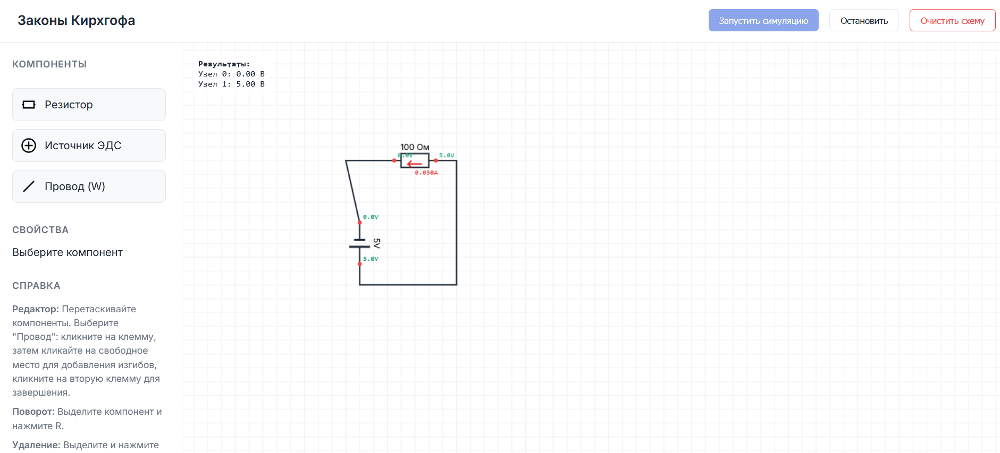

# Интерактивный стенд: Законы Кирхгофа

Веб-приложение для моделирования электрических цепей постоянного тока и изучения законов Кирхгофа (KCL и KVL).

## Возможности

*   **Визуальный редактор схем**:
    *   Добавление резисторов и источников ЭДС (Drag & Drop).
    *   Рисование проводов с поддержкой изгибов (ортогональная трассировка).
    *   Поворот (R) и удаление (Del) компонентов.
    *   Навигация: Зум (колесико) и Панорама (средняя кнопка мыши).
*   **Симуляция в реальном времени**:
    *   Расчет токов и напряжений методом узловых потенциалов (MNA).
    *   Визуализация направления и величины токов.
    *   Отображение потенциалов в узлах.
*   **Образовательные инструменты**:
    *   **Проверка 1-го закона (KCL)**: Наведите курсор на узел, чтобы увидеть сумму входящих и выходящих токов.
    *   **Проверка 2-го закона (KVL)**: Выделяется контур для наглядности (в разработке).
*   **Соответствие стандартам**:
    *   Условные графические обозначения (УГО) по ГОСТ (резистор в виде прямоугольника).
    *   Единицы измерения на русском языке (Ом, В, А).

## Технологии

*   **HTML5 / CSS3**: Верстка и стилизация (Flexbox, CSS Variables).
*   **JavaScript (ES6+)**: Логика приложения, без использования сторонних библиотек.
*   **Canvas API**: Отрисовка схем и анимации.

## Запуск

Проект не требует сборки или установки зависимостей.

1.  Скачайте репозиторий.
2.  Откройте файл `index.html` в любом современном браузере.

## Управление

*   **Левая кнопка мыши**:
    *   Перетаскивание компонентов из палитры.
    *   Выделение и перемещение компонентов на схеме.
    *   Рисование проводов (в режиме "Провод"): клик-клик для создания сегментов.
*   **Колесико мыши**: Масштабирование (Zoom).
*   **Средняя кнопка мыши**: Перемещение поля (Pan).
*   **R**: Повернуть выделенный компонент.
*   **Delete / Backspace**: Удалить выделенный компонент.

## Лицензия

MIT
